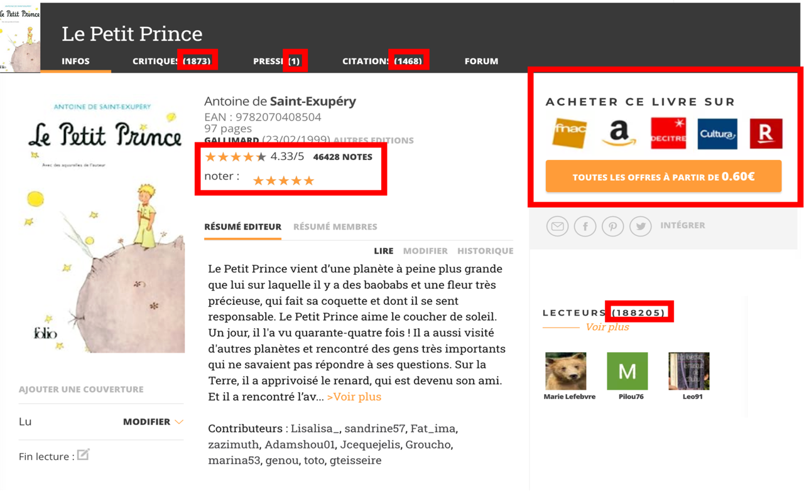

A Chrome extension removing all statistics, rankings, ratings, etc. from the interface of the French book recommendation platform Babelio.com. The goal of this plugin is to change how users perceive and interact with the website – and perhaps even how they read books.

This experiment was inspired by [Ben Grosser](https://bengrosser.com/) and his [Facebook Demetricator](https://chromewebstore.google.com/detail/facebook-demetricator/dbkgglbefgkimiadfjmgnkjmaoahephg).

---------

### Before :

### After :
